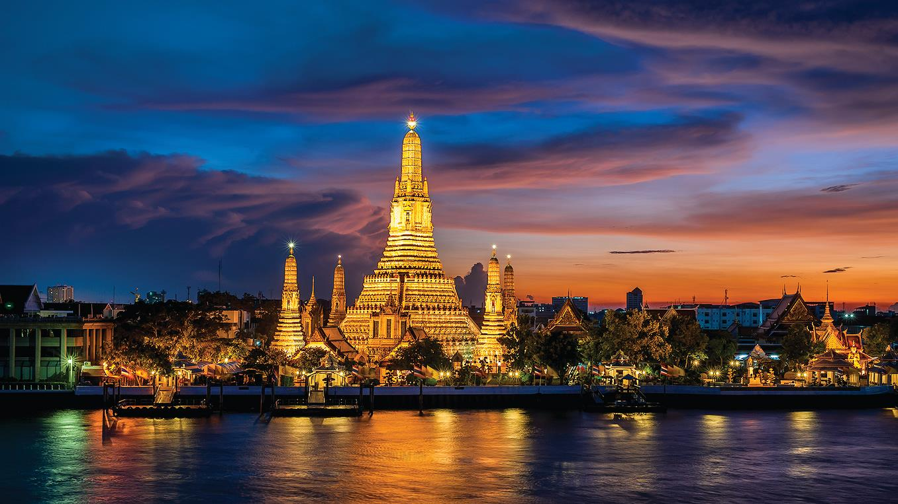
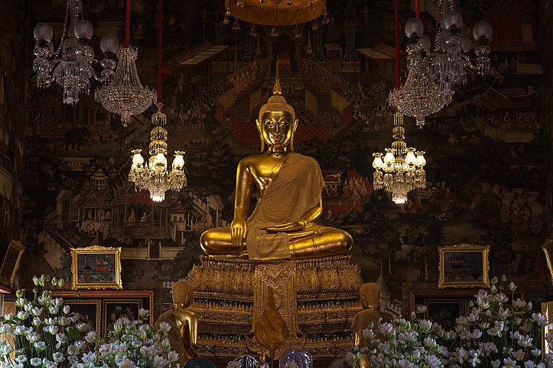
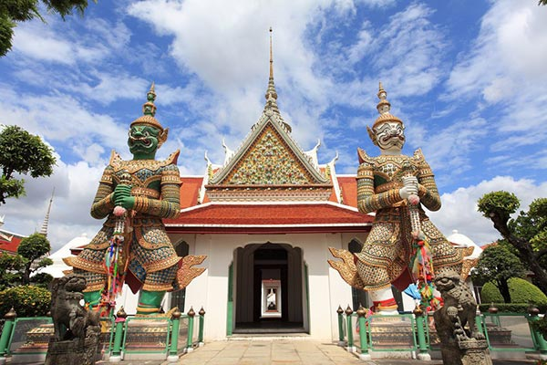

<html>
<head>
<meta charset= utf -8>
<title>วัดอรุณราชวราราม</title>
<link rel="stylesheet"
href="https://fonts.googleapis.com/css?family=Prompt" rel="stylesheet">

</head>
</head>

<body>
<h1>
วัดอรุณราชวราราม
</h1>

 

<b>ประวัติความเป็นมา</b>

<dd>
วัดอรุณราชวราราม (Temple of the Dawn, Bangkok) หรือที่ชาวบ้านนิยมเรียกกันติดปากว่า วัดแจ้ง (Temple in Bangkok) เป็น พระอารามหลวงชั้นเอกพิเศษ เป็นวัดโบราณที่มีมาตั้งแต่ครั้งสมัยกรุงศรีอยุธยาเดิมทีเรียกว่า วัดมะกอก ต่อมาในสมัยพระเจ้ากรุงธนบุรี ชาวบ้านเรียกจนติดปากว่า วัดแจ้ง เมื่อพระเจ้ากรุงธนบุรีย้ายราชธานีจากกรุงศรีอยุธยามาตั้ง ณ กรุงธนบุรี ได้โปรดเกล้าฯ ให้วัดแจ้งเป็นวัดในเขตพระราชฐาน และใช้เป็นที่ประดิษฐานพระแก้วมรกตที่ได้อัญเชิญมาจากเวียงจันทน์ ต่อมาในสมัยรัตนโกสินทร์ พระบาทสมเด็จพระพุทธยอดฟ้าจุฬาโลกมหาราช สมเด็จพระเจ้าลูกยาเธอ เจ้าฟ้ากรมหลวงอิศรสุนทร ได้เสด็จมาประทับที่พระราชวังเดิม และทรงปฏิสังขรณ์วัดแจ้งใหม่ทั้งหมด แต่ยังไม่ทันสำเร็จก็สิ้นรัชกาลที่ 1 กระทั่งเมื่อสมเด็จฯ เจ้าฟ้ากรมหลวงอิศรสุนทร เสด็จขึ้นครองราชย์เป็นพระบาทสมเด็จพระพุทธเลิศหล้านภาลัย วัดแห่งนี้จึงได้รับการบูรณปฏิสังขรณ์ครั้งใหญ่อีกครั้ง และถือเป็นวัดประจำรัชกาลที่ 2 เมื่อบูรณะเสร็จ ได้พระราชทานนามว่า “วัดอรุณราชธาราม” โดยมีพระราชดำริที่จะเสริมสร้างพระปรางค์หน้าวัดให้สูงขึ้น แต่สิ้นรัชกาลเสียก่อน ในสมัยรัชกาลที่ 3 จึงมีการก่อสร้างเสริมพระปรางค์องค์ใหญ่ให้มีความสูง 82 เมตร กว้าง 234 เมตร และแล้วเสร็จสมบูรณ์ในสมัยพระบาทสมเด็จพระจอมเกล้าเจ้าอยู่หัว รัชกาลที่ 4 อีกทั้ง พระองค์ทรงโปรดเกล้าฯ ให้มีการบูรณปฏิสังขรณ์วัดอรุณราชธารามหลายรายการ และให้อัญเชิญพระบรมอัฐิ ของพระบาทสมเด็จพระพุทธเลิศหล้านภาลัยมาบรรจุไว้ที่พระพุทธอาสน์ของพระประธานในพระอุโบสถด้วย เมื่อการปฏิสังขรณ์เสร็จสิ้นลง พระราชทานนามใหม่ว่า “วัดอรุณราชวราราม” (Temple of the Dawn, Bangkok) นับจากนั้นเป็นต้นมา</dd>

<b>นับถือนิกาย</b>

<ul>
<li><a href="#y">เถรวาท</a></li>
<li><a href="#g">มหานิกาย</a></li>
</ul>

<b>พระพุทธรูป</b>

<ul>
<li>พระพุทธชัมพูนุช</li>
<li>พระแจ้ง</li>
<li>พระพุทธนฤมิตร</li>
</ul>

<h2>
<a name="y">นิกายเถรวาท</a></h2>

<dd>
นิกายเถรวาทเป็นนิกายหลักที่ได้รับการนับถือในประเทศศรีลังกา (ประมาณ 70% ของประชากรทั้งหมด[1]) และประเทศในแผ่นดินเอเชียตะวันออกเฉียงใต้ ได้แก่ ไทย กัมพูชา ลาว และพม่า และเป็นส่วนน้อยในประเทศจีนและเวียดนาม โดยเฉพาะในมณฑลยูนนาน เนปาล บังกลาเทศที่เขตจิตตะกอง เวียดนามทางตอนใต้ใกล้ชายแดนกัมพูชา อินโดนีเซีย มาเลเซียมีนับถือทางตอนเหนือของประเทศ มีศาสนิกส่วนใหญ่เป็นชาวไทยและชาวสิงหล ตัวเลขผู้นับถือศาสนาพุทธนิกายเถรวาทอยู่ที่ประมาณ 100 ล้านคน</dd>

<dd>สำหรับประเทศไทยมีผู้นับถือพุทธศาสนานิกายเถรวาทประมาณ 94% ของประชากรทั้งหมด [2] (ข้อมูลจากกรมศาสนา เฉพาะประชากรอิสลามในประเทศไทยมีไม่น้อยกว่า 10 ล้านคน คิดเป็นสัดส่วนไม่น้อยกว่า 15% ของประชากรไทย ไม่นับผู้นับถือศาสนาคริสต์ ฮินดู สิกข์ และไม่มีศาสนา จึงเป็นไปได้ว่าชาวพุทธในประเทศไทย อาจมีไม่ถึง 80% ของจำนวนประชากรทั้งหมด)

นิกายเถรวาทได้รับการนับถือคู่กับนิกายอาจริยวาท (คือนิกายมหายาน ในปัจจุบัน)</dd>

<h2>
<a name="g">มหานิกาย</a></h2>

<dd>
มหานิกาย เป็นคำเรียกนิกายหรือคณะของพระสงฆ์ไทยสายเถรวาทลัทธิลังกาวงศ์ ซึ่งเป็นพระสงฆ์ส่วนใหญ่ในประเทศไทย เป็นฝ่ายคันถธุระ

เดิมนั้น คำเรียกแบ่งแยกพระสงฆ์สายเถรวาทในประเทศไทยออกเป็นมหานิกายและธรรมยุติกนิกายยังไม่มี เนื่องจากคณะพระสงฆ์ไทยในสมัยโบราณ ก่อนหน้าที่จะมีการจัดตั้งคณะธรรมยุตขึ้นในรัชสมัยพระบาทสมเด็จพระจอมเกล้าเจ้าอยู่หัวนั้น ไม่มีการแบ่งแยกออกเป็นนิกายต่าง ๆ โดยส่วนใหญ่พระสงฆ์ไทยนั้นล้วนแต่เป็นเถรวาทสายลังกาวงศ์ ทั้งสิ้น จนเมื่อพระวชิรญาณเถระ หรือเจ้าฟ้ามงกุฏ (พระบาทสมเด็จพระจอมเกล้าเจ้าอยู่หัว รัชกาลที่ 4) ได้ก่อตั้งนิกายธรรมยุตขึ้นในปี พ.ศ. 2376 แยกออกจากคณะพระสงฆ์ไทยที่มีมาแต่เดิมซึ่งเป็นพระสงฆ์ส่วนใหญ่ในสมัยนั้น จึงทำให้พระองค์คิดคำเรียกพระสงฆ์ส่วนใหญ่ในประเทศไทยที่เป็นสายเถรวาทลังกาวงศ์เดิมว่า พระส่วนมาก หรือ มหานิกาย

ซึ่งคำ มหานิกาย นั้น มาจากธาตุศัพท์ภาษาบาลี มหนฺต + นิกาย แปลว่าพวกมาก กล่าวโดยสรุป มหานิกายก็คือ พระสงฆ์สายเถรวาทลังกาวงศ์ดั้งเดิมในประเทศไทยส่วนใหญ่ที่ไม่ใช่พระสงฆ์ธรรมยุติกนิกาย

<b>ระเบียงรูปภาพ</b>

<table border="3">
<tr>
<th>พระพุทธธรรมมิศราชโลกธาตุดิลก พระประธานในพระอุโบสถวัดอรุณฯ
</th>
<th>พระในวัดอรุณ </th>
<th>ประติมากรรมยักษ์ทศกัณฐ์ (สีเขียว) และยักษ์สหัสเดชะ (สีขาว) </th>
</tr>
<tr>
<td>

</td>
<td>
</td>
<td>
</td>
</tr>
<tr>
<td>
พระประธาน</td>
<td>
วัดอรุณราชวราราม</td>
<td>
สถานที่สำคัญ</td>
</tr>
</table>

<b>สิ่งที่น่าสนใจภายในวัด</b>
<dd>
พระปรางค์ ซึ่งประดับด้วยกระเบื้องเคลือบ ถ้วยชามเบญจรงค์และเปลือกหอย</dd>
รูปปั้นยักษ์ ซึ่งมีตำนานเล่าขานเกี่ยวกับยักษ์วัดแจ้งแห่งนี้คู่กับยักษ์วัดโพธิ์ที่อยู่ฝั่งตรงข้าม
นอกจากนี้ก็ยังมีพระอุโบสถ ซุ้มประตูยอดมงกุฎ หอระฆัง ภูเขาจำลอง และพระพุทธรูปต่างๆ 

<b>- วีดีโอแนะนำความเป็นมาของวัดอรุณราชวราราม - </b>

<iframe width="560" height="315" src="https://www.youtube.com/embed/haT_nah6L7Q" frameborder="0" allow="accelerometer; autoplay; encrypted-media; gyroscope; picture-in-picture" allowfullscreen></iframe>

 Facebook : กฤษฎา ป้องศรี
 Line : Kritsada_nine

</body>
</html>
